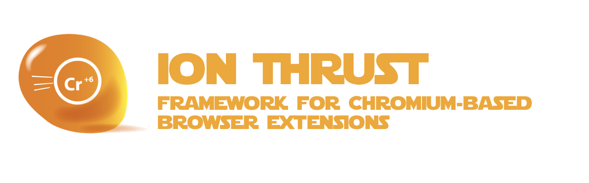

# ionthrust



> **THIS PROJECT IS STILL IN THE DESIGN PHASE**
>
> IDEAS & CONTRIBUTIONS ARE WELCOME
>
> An [Open Source Universe](https://github.com/intellibus/approach) Project

---

## Contents

- [ionthrust](#ionthrust)
  - [Contents](#contents)
  - [Features ✨](#features-)
  - [Install 🛠](#install-)
  - [Usage 🔭](#usage-)
  - [Documentation 🛰](#documentation-)
  - [Contributing 🌎](#contributing-)
  - [License ⚖️](#license-️)

## Features ✨

- Create Chrome Extensions with Svelte `Planned`
- Unified State Management via `fysics` `Planned`
- Annotate Functions as Background or Content-Script `Planned`
- Automatic Code Splitting between Background & Content Scripts `Planned`
- Typescript Support `Planned`

## Install 🛠

```sh
npm install ionthrust
```

## Usage 🔭

Read more about the [Design](https://github.com/intellibus/ionthrust/blob/main/DESIGN.md) behind `ionthrust` here.

```typescript
// @ion-thrust background
const backgroundFunction = async (data) => {
  await chrome.storage.local.set({ data });
}

// @ion-thrust content-script
const contentScriptFunction = async () => {
  const element = document.querySelector('div > div > .class > a');
  await backgroundFunction({ text: element.innerText });
}

// Ion Thrust Automatically Creates a Messaging Channel between both functions to support RPC.
```

## Documentation 🛰

`ionthrust` *is under active development, documentation will be added once an initial release is ready.*

## Contributing 🌎

We would love for you to contribute your ideas, code, & fixes to `ionthrust`.

We encourage everyone to read our [Design Document](https://github.com/intellibus/ionthrust/blob/main/DESIGN.md) to learn more about the thought process behind ionthrust.

Also check out the [rewards](https://github.com/intellibus/approach/blob/main/REWARDS.md) offered for contributing to the [Open Source Universe](https://github.com/intellibus/approach).

## License ⚖️

MIT
